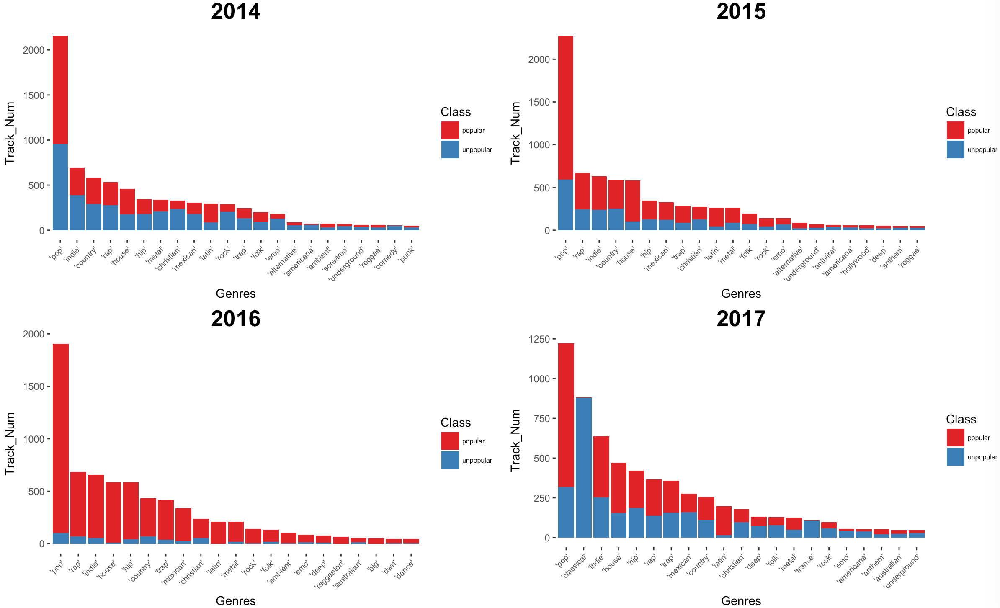
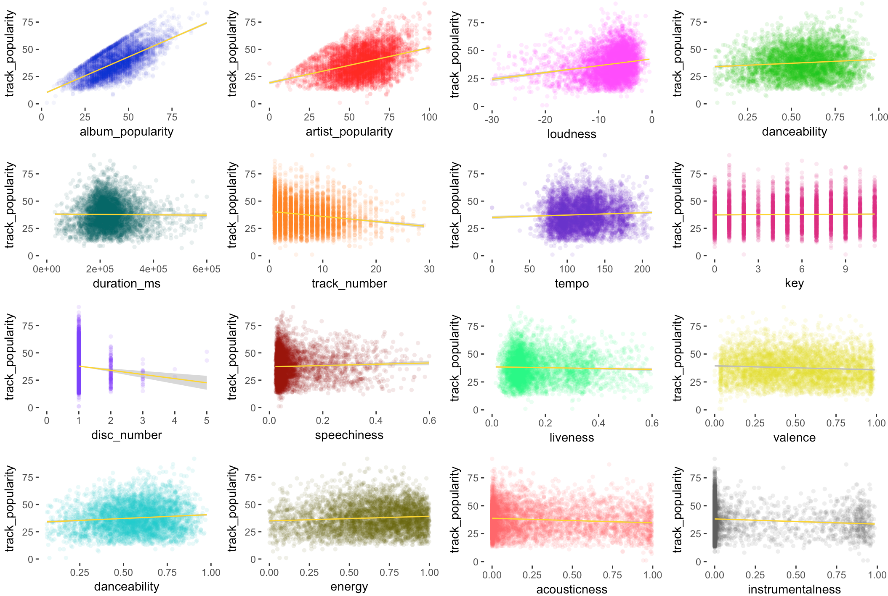
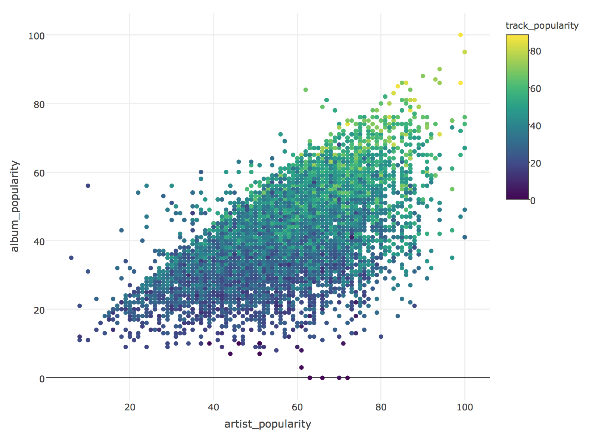
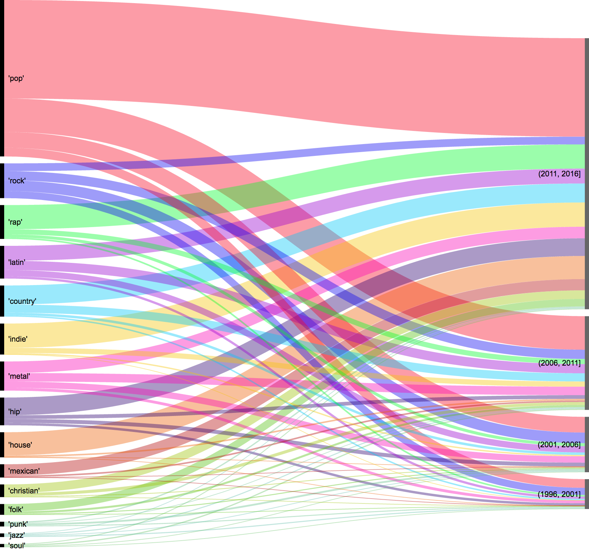

## Music Data Trend Analysis

https://jerryguangxu.github.io/Spotify-Music-Data-Analysis/

## Project introduction

In this project, we conducted data mining for the information of 200000 tracks over the past 20 years (10000 tracks per year). 

The information was pulled out from Spotify API and include: 
1. General numeric features (e.g. release time, popularity, artist popularity), 
2. Numeric physical properties (e.g. loudness, duration) 
3. Non-numeric ones (e.g. genres, album name, artist name)

One critical target variable is `track popularity`, which we used as indicator of popularity. It's provided by Spotify API, and calcuated by algorithms based on total number of plays the track has had and how recent those plays are.

### The purposes are to provide some insight for the trend of music industry:

    1. Analyze the trend of music development over past 20 years. 

       *For example, the track has been louder than before? Or duration is longer than before?*
   
    2. Analyze what features are associated with popularity, and establish models to predict track popularity by machi

       *For example, is louder song more popular nowadays?*

### General pipeline and techniques:
    1. API extract and data snippet
    2. Data clean and transform
    3. Data visualization
    4. Machine learning and modeling

### I. General trend of music over past 20 years

1. What types of music do we listen these days?
   
   Barplot for number of different genres of tracks which are either popular or unpopular
   
   We define "popular songs" as those with track popularity score ranking at top 20
 
   

   
   

 
 
 
 

2. Barplot for number of different genres of tracks for the past four years. 
   
   

   
   

3. Time series barplot for 16 different numeric features.

   
   

   
   

### II. General trend of music over past 20 years
1. Feature correlati
   
   

   
   

### III. Three popularity
1. Feature correlati 
   
   

   
   

   

### Jekyll Themes

Your Pages site will use the layout and styles from the Jekyll theme you have selected in your [repository settings](https://github.com/JerryGuangXu/Spotify-Music-Data-Analysis/settings). The name of this theme is saved in the Jekyll `_config.yml` configuration file.

### Support or Contact

Having trouble with Pages? Check out our [documentation](https://help.github.com/categories/github-pages-basics/) or [contact support](https://github.com/contact) and we’ll help you sort it out.

### III. Model Selection: Random Forest Regression
1. Feature correlation

   Some features are highly correlated, for example, Sodium and Chloride concentration, 
   also ALT(SGPT) and AST(SGOT),two aminotransferases enzymes.
   Some correlated features are interesting, such as platelets count and pulse.
   
   

   
   

