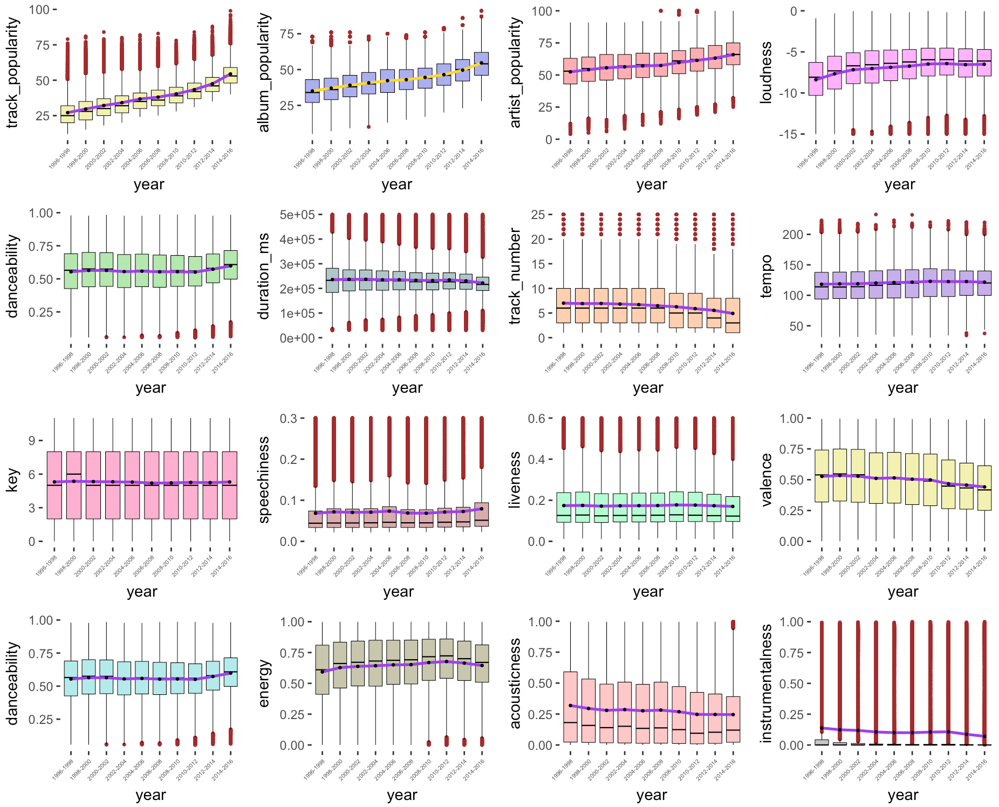
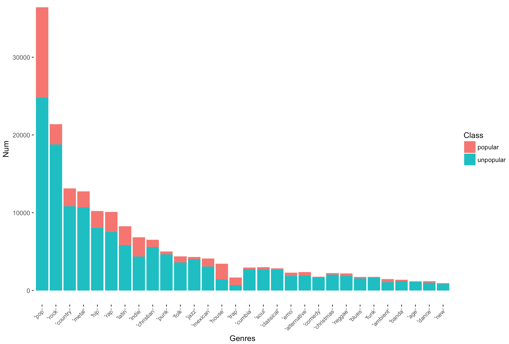
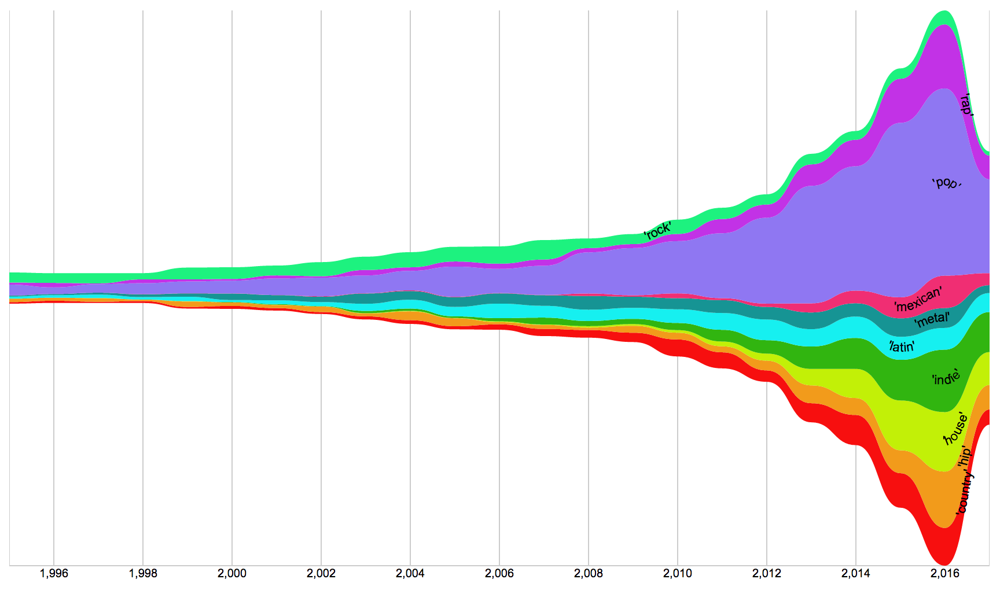
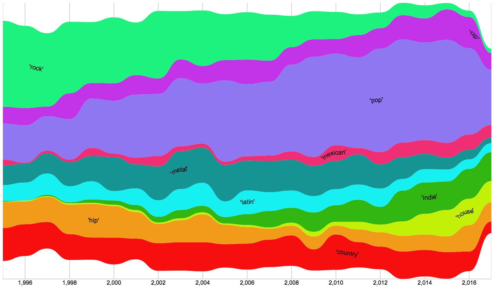
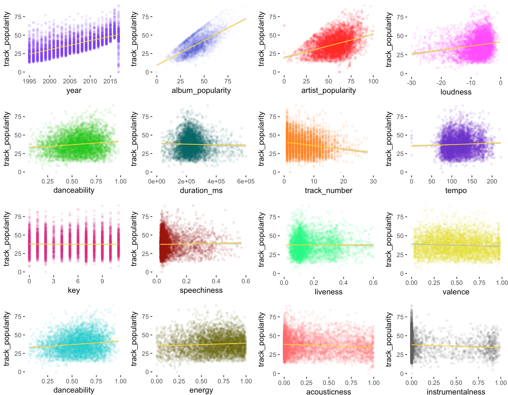
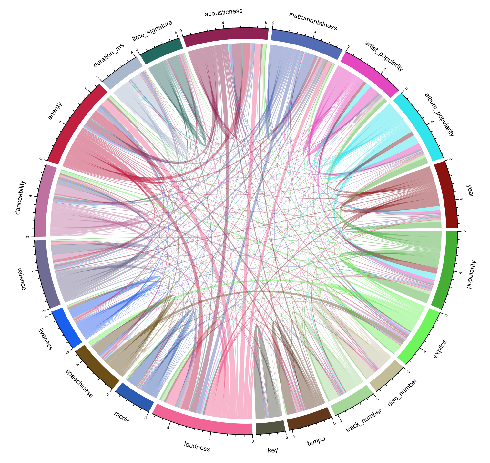

## Project Introduction

In this project, we conducted data mining for 200000 tracks over the past 20 years, in order to analyze the trend of music industry development, and produce a predictive model for track popularity.


<span style="color:red">some **This is Red Bold.** </span>

## Project Goals:

**Analyze the trend of music development over past 20 years.** 

  For example:
   
 ⋅⋅⋅*Music has generally been louder than before?*
   
 ⋅⋅⋅*What novel types of music have evolved popular in the past five years?*


**Establish models to predict track popularity by machine learning algorithms.**


## Data Extraction and Transformation

**Spotify has provided amazing API resources:**

   [Spotify API link](https://developer.spotify.com/web-api/track-endpoints/)

**We randomly extracted data for 10000 tracks per year for the past 20 years.**
```python
url = 'https://api.spotify.com/v1/search?q=year:'+ keywords +'&type=' + search_type +'&offset='+ off +'&limit=' + lim
requests.get(url).json()
```

**Then acquire audio feature data by track_id; Access_token is required for this.**

```python
url = 'https://api.spotify.com/v1/audio-features?ids=' + track_ids
requests.get(url, headers={"Authorization": access_token})
```

**Get items from complicated nested list**
For example,
```python
str = j['tracks']['items']['popularity']
```


**Vectorization of text (e.g. genres or name) by bag-of-words model.**

```python
vectorizer = CountVectorizer(analyzer='word',max_features=100)
WordVec = vectorizer.fit_transform(dicname[name]).toarray().tolist()
```

**Then merge into Pandas Dataframe and start feature engineering.**

Examples of feature engineering:
```python
## Remove NaN
df = df.dropna()

## Convert categorical features into numeric
df['explicit'] = df['explicit'].map( {True: 1, False: 0} ).astype(int) 

## New 'year' feature 
df['year'] = [x.split('-')[0] for x in df['album_release_date']]

## Simplify genre names by choosing the most common word
def reduce_genres(gen):
    genre = re.sub("[^a-zA-Z0-9]"," ",gen).lower().split()
    ...
    mode1 = str(stats.mode(genre)).split('[')[1].split(']')[0]
    return mode1
    
```

**Final cleaned data include:**

⋅⋅⋅1. General numeric features *(e.g. release time, track popularity, artist popularity)*

⋅⋅⋅2. Numeric physical properties *(e.g. loudness, duration)*

⋅⋅⋅3. Vectorized Non-numeric ones *(e.g. genres, album name, artist name)*

**Critical features include:**

⋅⋅⋅A. **Track_Popularity**
   
   Major indicator of song popularity and later used for correlation and data training in this project. It reflects "hotness"    by today's music listeners, calculated by total number of plays.

⋅⋅⋅B. **Year**
   
   Used extensively for time-series analysis to demonstrate the trend of music evolution in the project.


## Exploratory Data Analysis and Data Visualization

### General trend of numeric features of songs over past 20 years

   Time-series boxplot for 16 different numeric features. (Purple lines reflect mean) 
   
   We could easily find recent tracks, album and artists are favored by today's listeners.
   
   **Loudness** and **energy** have slightly _increased_; while **valence** and **acousticness** _decreased_.
   
   **Track number** has been _lower_ in recent 10 years, indicating album is _smaller_ nowadays.
   
   <p align="center">
   
   </p>


### Popularity Analysis

1. What types of tracks are prefered by listeners today?
   
   Barplot for number of different genres of tracks for all tracks.
   
   We define "popular songs" as those with track popularity score ranking at top 20 
 
   <p align="center">
   
   </p>
 
 


2. Barplot for number of different genres of tracks for the past four years. 

   
   <p align="center">
   
   </p>

   <p align="center">
   
   </p>

3. Time-series analysis of popularity for different genres of music.

   <p align="center">
   
   </p>


4. Which features are associated with track popularity? 
   Scatterplot between track popularity and features.
 
   <p align="center">
   
   </p>


5. Album popularity and artist popularity are two strong features linearly associated.
 
   <p align="center">
   
   </p>


### Modeling: Random Forest Regression
```
Before ML, correlation map for different features
```
   <p align="center">
   
   </p>

### Modeling: Random Forest Regression
```
1. xgbclassifier tune parameters
2. Which features are most predictive?
----MAKE wordle!
```

We define "popular songs" as those with track popularity score ranking at top 20 
 
   <p align="center">
   
   </p>
 
