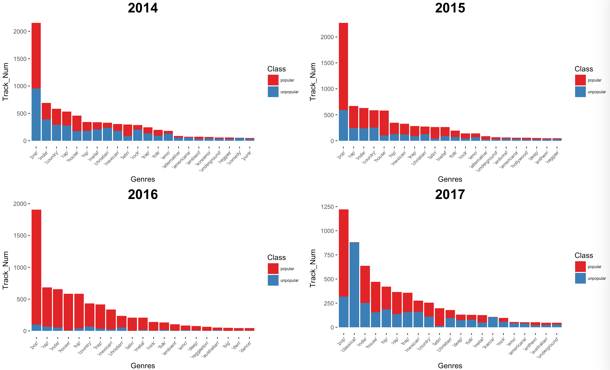

## Music Data Trend Analysis

https://jerryguangxu.github.io/Spotify-Music-Data-Analysis/
In this project, we conducted data mining for the information of 200000 tracks over the past 20 years (10000 tracks per year). 

The information was pulled out from Spotify API and include: 
1. General numeric features (e.g. release time, popularity, artist popularity), 
2. Numeric physical properties (e.g. loudness, duration) 
3. Non-numeric ones (e.g. genres, album name, artist name)

The purposes are:
a. Analyze the trend of music development over past 20 years. 
   *For example, the track has been louder than before? Or duration is longer than before?*
b. Analyze what features are associated with popularity, and establish models to predict track popularity by machine learning    algorithms.
   *For example, is louder song more popular nowadays? *

### Markdown
`
lalal
`

For more details see [GitHub Flavored Markdown](https://guides.github.com/features/mastering-markdown/).

### I.Scatterplot: 
1. Feature correlation

   Some features are hig
   
   

   
   

### III. Three popularity
1. Feature correlati 
   
   

   
   

   

### III. Three popularity
1. Feature correlati 
   
   

   
   

### III. Three popularity
1. Feature correlati 
   
   

   
   

### III. Three popularity
1. Feature correlati 
   
   

   
   

### Jekyll Themes

Your Pages site will use the layout and styles from the Jekyll theme you have selected in your [repository settings](https://github.com/JerryGuangXu/Spotify-Music-Data-Analysis/settings). The name of this theme is saved in the Jekyll `_config.yml` configuration file.

### Support or Contact

Having trouble with Pages? Check out our [documentation](https://help.github.com/categories/github-pages-basics/) or [contact support](https://github.com/contact) and we’ll help you sort it out.

### III. Model Selection: Random Forest Regression
1. Feature correlation

   Some features are highly correlated, for example, Sodium and Chloride concentration, 
   also ALT(SGPT) and AST(SGOT),two aminotransferases enzymes.
   Some correlated features are interesting, such as platelets count and pulse.
   
   

   
   

